# Daybreak Health Database Schema - ER Diagram

```mermaid
erDiagram
    patients_and_guardians ||--o{ kinships : "user_0_id"
    patients_and_guardians ||--o{ kinships : "user_1_id"
    clinicians ||--o{ kinships : "user_0_id"
    clinicians ||--o{ kinships : "user_1_id"
    clinicians ||--o{ clinicians : "supervisor_id"
    clinicians ||--o{ patients_and_guardians : "supervisor_id"
    patients_and_guardians ||--o{ questionnaires : "subject_id"
    patients_and_guardians ||--o{ questionnaires : "respondent_id"
    clinicians ||--o{ questionnaires : "respondent_id"
    patients_and_guardians ||--o{ insurance_coverages : "user_id"
    patients_and_guardians ||--o{ insurance_coverages : "created_by"
    clinicians ||--o{ insurance_coverages : "created_by"
    patients_and_guardians ||--o{ referrals : "submitter_id"
    clinicians ||--o{ referrals : "care_provider_id"
    patients_and_guardians ||--o{ referral_members : "user_id"
    patients_and_guardians ||--o{ memberships : "user_id"
    clinicians ||--o{ memberships : "user_id"
    patients_and_guardians ||--o{ patient_availabilities : "user_id"
    clinicians ||--o{ clinician_insurance_affiliations : "care_provider_profile_id"
    
    questionnaires ||--o{ referrals : "intake_id"
    
    clinician_credentialed_insurances ||--o{ clinician_credentialed_insurances : "parent_credentialed_insurance_id"
    clinician_credentialed_insurances ||--o{ clinician_insurance_affiliations : "credentialed_insurance_id"
    
    organizations ||--o{ organizations : "parent_organization_id"
    organizations ||--o{ referrals : "organization_id"
    organizations ||--o{ org_contracts : "organization_id"
    organizations ||--o{ memberships : "organization_id"
    
    contracts ||--o{ referrals : "contract_id"
    contracts ||--o{ org_contracts : "contract_id"
    
    referrals ||--o{ referral_members : "referral_id"

    patients_and_guardians {
        uuid id PK
        integer role
        varchar email
        varchar phone
        varchar first_name
        varchar last_name
        uuid supervisor_id
        text_array system_labels
        jsonb profile_data
        jsonb address
        timestamptz created_at
        timestamptz updated_at
    }
    
    clinicians {
        uuid id PK
        varchar healthie_id
        integer account_status
        varchar email
        varchar first_name
        varchar last_name
        uuid supervisor_id
        text_array system_labels
        jsonb profile_data
        jsonb address
        timestamptz created_at
        timestamptz updated_at
    }
    
    kinships {
        uuid id PK
        uuid user_0_id FK
        uuid user_1_id FK
        integer kind
        integer user_0_label
        integer user_1_label
        boolean guardian_can_be_contacted
        timestamptz created_at
        timestamptz updated_at
    }
    
    questionnaires {
        uuid id PK
        uuid subject_id FK
        uuid respondent_id FK
        integer score
        integer type
        jsonb question_answers
        timestamptz started_at
        timestamptz completed_at
        timestamptz created_at
        timestamptz updated_at
    }
    
    clinician_credentialed_insurances {
        uuid id PK
        varchar name
        varchar state
        integer network_status
        uuid parent_credentialed_insurance_id FK
        timestamptz created_at
        timestamptz updated_at
    }
    
    insurance_coverages {
        uuid id PK
        uuid user_id FK
        uuid created_by FK
        varchar insurance_company_name
        integer kind
        integer eligibility
        text_array system_labels
        jsonb profile_data
        timestamptz created_at
        timestamptz updated_at
    }
    
    organizations {
        uuid id PK
        uuid parent_organization_id FK
        integer kind
        varchar slug
        varchar name
        uuid market_id
        jsonb config
        timestamptz created_at
        timestamptz updated_at
    }
    
    contracts {
        uuid id PK
        date effective_date
        date end_date
        text_array services
        jsonb terms
        text contract_url
        timestamptz created_at
        timestamptz updated_at
    }
    
    org_contracts {
        uuid id PK
        uuid organization_id FK
        uuid contract_id FK
        timestamptz created_at
        timestamptz updated_at
    }
    
    referrals {
        uuid id PK
        uuid submitter_id FK
        uuid organization_id FK
        uuid contract_id FK
        uuid market_id
        integer service_kind
        uuid intake_id FK
        uuid care_provider_id FK
        text_array system_labels
        timestamptz onboarding_completed_at
        timestamptz enrolled_at
        timestamptz created_at
        timestamptz updated_at
    }
    
    referral_members {
        uuid id PK
        uuid referral_id FK
        uuid user_id FK
        integer role
        jsonb data
        timestamptz created_at
        timestamptz updated_at
    }
    
    memberships {
        uuid id PK
        uuid user_id FK
        uuid organization_id FK
        jsonb profile_data
        timestamptz created_at
        timestamptz updated_at
    }
    
    patient_availabilities {
        uuid id PK
        uuid user_id FK
        jsonb availability
        timestamptz created_at
        timestamptz updated_at
    }
    
    clinician_availabilities {
        integer id PK
        integer user_id
        timestamptz range_start
        timestamptz range_end
        varchar timezone
        integer day_of_week
        boolean is_repeating
        timestamptz created_at
        timestamptz updated_at
    }
    
    clinician_insurance_affiliations {
        uuid id PK
        uuid care_provider_profile_id FK
        uuid credentialed_insurance_id FK
        timestamptz created_at
        timestamptz updated_at
    }
    
    documents {
        uuid id PK
        integer version
        varchar label
        text_array checkboxes
        date version_date
        jsonb urls
        jsonb names
        timestamptz created_at
        timestamptz updated_at
    }
```

## Key Relationships

### Core User Relationships
- **clinicians** → **clinicians** (self-referential): `supervisor_id` - clinicians can have supervisors
- **clinicians** → **patients_and_guardians**: `supervisor_id` - patients/guardians can have clinician supervisors
- **patients_and_guardians** → **kinships**: Patients/guardians can have multiple kinship relationships (guardian/child)
- **clinicians** → **kinships**: Clinicians can also be in kinship relationships
- **patients_and_guardians** → **questionnaires**: Patients/guardians can be subjects or respondents of questionnaires
- **clinicians** → **questionnaires**: Clinicians can be respondents of questionnaires
- **patients_and_guardians** → **insurance_coverages**: Patients/guardians have insurance coverage records
- **patients_and_guardians** → **referrals**: Patients/guardians can submit referrals
- **clinicians** → **referrals**: Clinicians can be assigned as care providers
- **patients_and_guardians** → **memberships**: Patients/guardians belong to organizations
- **clinicians** → **memberships**: Clinicians can belong to organizations
- **patients_and_guardians** → **patient_availabilities**: Patients/guardians can specify their availability for scheduling
- **clinicians** → **clinician_insurance_affiliations**: Clinicians have insurance network affiliations via `care_provider_profile_id`

### Organization & Contract Relationships
- **organizations** → **organizations** (self-referential): `parent_organization_id` - districts contain schools
- **organizations** → **contracts**: Many-to-many via `org_contracts` junction table
- **organizations** → **referrals**: Organizations receive referrals
- **contracts** → **referrals**: Referrals are associated with contracts

### Referral & Care Flow
- **referrals** → **referral_members**: Referrals can have multiple patient members
- **referrals** → **questionnaires**: Referrals can reference intake questionnaires

### Insurance Relationships
- **clinician_credentialed_insurances** → **clinician_credentialed_insurances** (self-referential): Parent insurance companies
- **clinician_credentialed_insurances** → **clinician_insurance_affiliations**: Clinicians can accept multiple insurances
- **clinicians** → **clinician_insurance_affiliations**: Clinicians have insurance network affiliations via `care_provider_profile_id` (maps to `clinicians.id`)

## Notes

- **Separate User Tables**: `patients_and_guardians` and `clinicians` tables match CSV file structure (16 CSV files = 16 tables)
- **Users View**: Optional `users` view can be created to provide unified query interface across both user tables
- **Cross-Table References**: Some foreign keys (e.g., `kinships.user_0_id`, `kinships.user_1_id`, `memberships.user_id`) can reference either table and are validated at application level since PostgreSQL doesn't support FKs to multiple tables
- All primary keys are UUIDs except `clinician_availabilities.id` which is INTEGER (legacy from parquet export)
- `clinician_availabilities.user_id` is INTEGER (references `healthie_id`, not a direct foreign key to clinicians table)
- `clinician_insurance_affiliations.care_provider_profile_id` maps to `clinicians.id`
- `market_id` in `referrals` and `organizations` is always set to 1 (UUID: '00000000-0000-0000-0000-000000000001')
- Many tables include `_fivetran_deleted` and `_fivetran_synced` columns for data sync tracking
- JSONB columns are used for flexible data structures (profile_data, question_answers, availability, etc.)
- Array columns (TEXT[]) are used for system_labels, services, etc. with GIN indexes
- Tables removed: `appointments`, `document_consents`, `census_persons` (not present in CSV test data)

